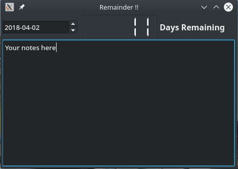

# Remainder
Remainder app in PyQt

## Installation
#### Install qt4 and pyqt4.

For debian based distros.
```
# apt-get install python-qt4
```
#### Clone the repo
```
$ git clone https://github.com/anuragregmi/remainder/
```
#### Change directory
```
$ cd remainder/
```

#### Run
```
python remainder
```

## You can
- set date and find days remaining
- write your notes

## Demo

